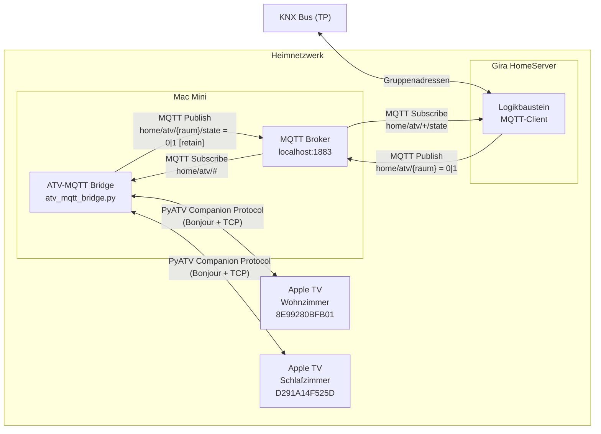

# §03 Kontextabgrenzung — ATV-KNX Bridge

## Systemkontext

---

## Externe Schnittstellen

### MQTT-Schnittstelle (Gira HomeServer ↔ Bridge)

Der Gira HomeServer kommuniziert ausschließlich über MQTT. Er publiziert Steuerbefehle
und abonniert Statusrückmeldungen. Der MQTT Broker läuft auf demselben Mac Mini wie die Bridge.

**Steuerbefehle (Eingang → Bridge):**

| Topic | Payload | Bedeutung |
|-------|---------|-----------|
| `home/atv/wohnzimmer` | `1` oder `2` | Apple TV Wohnzimmer einschalten |
| `home/atv/wohnzimmer` | `0` | Apple TV Wohnzimmer ausschalten |
| `home/atv/schlafzimmer` | `1` oder `2` | Apple TV Schlafzimmer einschalten |
| `home/atv/schlafzimmer` | `0` | Apple TV Schlafzimmer ausschalten |

> **Hinweis:** Payload `2` wird von der Bridge wie `1` (AN) behandelt. Topics, die
> `/state` enthalten, werden von der Bridge ignoriert (Schutz vor Feedback-Schleifen).

**Statusrückmeldungen (Ausgang ← Bridge):**

| Topic | Payload | Bedeutung | Retained |
|-------|---------|-----------|----------|
| `home/atv/wohnzimmer/state` | `0` | Gerät AUS / Standby | ja |
| `home/atv/wohnzimmer/state` | `1` | Gerät AN | ja |
| `home/atv/schlafzimmer/state` | `0` | Gerät AUS / Standby | ja |
| `home/atv/schlafzimmer/state` | `1` | Gerät AN | ja |

> **Retained Messages:** Der Broker speichert den letzten State-Wert. Der Gira
> HomeServer erhält beim (Re-)Connect sofort den aktuellen Zustand.

---

### PyATV-Schnittstelle (Bridge ↔ Apple TV)

Die Bridge kommuniziert mit jedem Apple TV über das **Companion Protocol** der
PyATV-Bibliothek. Die Geräteerkennung erfolgt via **Bonjour/mDNS** im lokalen Netzwerk;
die eigentliche Steuerung über TCP.

| Gerät | MAC / Identifier | Protokoll |
|-------|-----------------|-----------|
| Apple TV Wohnzimmer | `8E99280BFB01` | Companion |
| Apple TV Schlafzimmer | `D291A14F525D` | Companion |

Credentials (Companion-Pairing-Tokens) sind derzeit direkt im Quellcode hinterlegt
(→ siehe §11 Risiken).

---

### KNX-Schnittstelle (indirekt — über Gira HomeServer)

Die Bridge hat **keinen direkten KNX-Zugang**. KNX-Nachrichten erreichen die Bridge
ausschließlich über den Umweg Gira HomeServer → MQTT. Das hält die Systemgrenze klar:
Die Bridge kennt keine KNX-Gruppenadressen.

---

## Nicht im Scope

- Direkte KNX-Integration (kein KNX-USB-Interface, kein KNXnet/IP)
- Steuerung anderer AV-Geräte (nur Apple TV via PyATV)
- Web-UI oder REST-API
- Unterstützung mehrerer MQTT-Broker
- Apple TV Mediensteuerung (Play, Pause, Volume) — nur Einschalten (Home-Button) und Ausschalten
