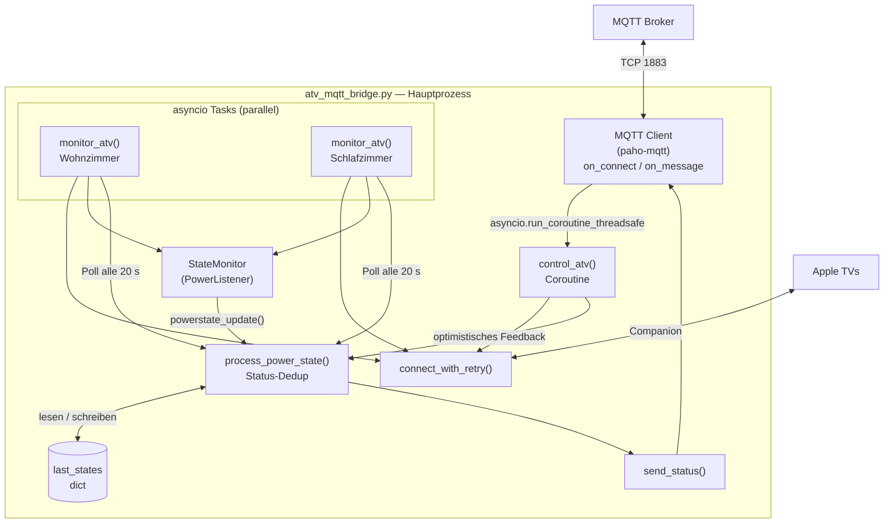

# §05 Bausteinsicht — ATV-KNX Bridge

## Ebene 1 — Gesamtüberblick



---

## Ebene 2 — Bausteinbeschreibungen

### MQTT Client (`mqtt.Client`, paho-mqtt)

**Verantwortung:** Verbindung zum MQTT-Broker, Subscription auf `home/atv/#`,
Empfang von Steuerbefehlen, Weitergabe an `control_atv()` via Thread-Bridge.

**Schnittstellen:**
- `on_connect` — wird bei Verbindungsaufbau aufgerufen; abonniert `home/atv/#`
- `on_message` — wird bei eingehender MQTT-Nachricht aufgerufen (im MQTT-Thread);
  filtert `/state`-Topics, extrahiert `device_key`, delegiert an `control_atv()`
  via `asyncio.run_coroutine_threadsafe()`

**Wichtig:** paho-mqtt ruft `on_message` in einem eigenen Thread auf. Die Brücke zum
asyncio-Event-Loop ist `run_coroutine_threadsafe` mit dem `loop`-Objekt aus `userdata`.

---

### `monitor_atv(device_key, mqtt_client)` — asyncio Task (je Gerät)

**Verantwortung:** Kontinuierliche Überwachung eines Apple TVs. Läuft als endlose
asyncio-Task parallel für jedes konfigurierte Gerät.

**Verhalten:**
1. Sucht das Gerät per Bonjour (`scan`, timeout=5 s)
2. Baut Verbindung auf (`connect_with_retry`)
3. Registriert `StateMonitor` als Event-Listener
4. Pollt den Power-State alle **20 Sekunden** (Fallback falls Events ausbleiben)
5. Bei Verbindungsverlust: schließt Verbindung, wartet **15 s**, Neuversuch
6. Gerät nicht gefunden (Deep Sleep): wartet **30 s**, Neuversuch

---

### `control_atv(device_key, action, mqtt_client)` — Coroutine

**Verantwortung:** Ausführung eines Steuerbefehls (AN/AUS) für ein Apple TV.

**Ablauf:**
1. Gerät per `scan` suchen (timeout=4 s)
2. Verbindung aufbauen — bei "No request handler"-Fehler `connect_with_retry()` nutzen
3. AN (`action in ["1","2"]`): `remote_control.home()` senden (simuliert Home-Tastendruck)
4. AUS (`action == "0"`): `power.turn_off()` aufrufen
5. Sofortiges **optimistisches Feedback** an `process_power_state()` (ohne auf ATV-Bestätigung zu warten)
6. Verbindung im `finally`-Block schließen

---

### `StateMonitor(PowerListener)` — Event-Listener

**Verantwortung:** Empfang von Echtzeit-Statusereignissen vom Apple TV via PyATV.

Implementiert `PowerListener.powerstate_update(old_state, new_state)`. Wird von
`monitor_atv()` als `atv.power.listener` registriert. Delegiert jeden Zustandswechsel
an `process_power_state()`.

---

### `connect_with_retry(atv_conf, loop, max_retries=5)` — Helper

**Verantwortung:** Robuste Verbindungsherstellung mit Wiederholungslogik.

Unterscheidet zwischen zwei Fehlerklassen:
- **"No request handler" / ProtocolError:** Companion-Dienst auf dem ATV ist noch nicht
  bereit (bekannter PyATV-Bug bei Deep Sleep). Wartet **2 s** und versucht erneut
  (max. 5 Mal).
- **Andere Fehler** (z. B. falsche Credentials): Bricht sofort ab, kein weiterer Versuch.

---

### `process_power_state(device_key, state, mqtt_client, source)` — Status-Deduplizierung

**Verantwortung:** Zentrale Verarbeitungsstelle für alle Zustandsinformationen.
Verhindert redundante MQTT-Publishes.

**Logik:**
- Normalisiert `PowerState` auf `"1"` (On, Dimming) oder `"0"` (alle anderen)
- Vergleicht mit `last_states[device_key]`
- Publiziert nur bei tatsächlicher Änderung via `send_status()`
- Aktualisiert `last_states`

Wird von drei Quellen aufgerufen: `StateMonitor` (Event), `monitor_atv` (Poll),
`control_atv` (optimistisches Feedback). Die Quelle wird im Log vermerkt.

---

### `send_status(client, device_key, numeric_val)` — MQTT Publisher

**Verantwortung:** Publiziert einen State-Wert auf `home/atv/{device_key}/state`
mit `retain=True`.

Mapping für Log-Ausgabe: `0=AUS`, `1=AN`, `2=OFFLINE`, `3=FEHLER`
(OFFLINE und FEHLER sind derzeit im Steuerungsfluss nicht belegt — potenzielle
Erweiterung für Fehlerfälle).

---

### `last_states` — Zustandsspeicher

**Verantwortung:** In-Memory-Dictionary, das den zuletzt publizierten MQTT-State
pro Gerät speichert. Verhindert redundante Publishes.

```python
last_states = {}  # z. B. {"wohnzimmer": "1", "schlafzimmer": "0"}
```

**Hinweis:** Globale Variable, aber race-condition-sicher im asyncio-Kontext
(Single-Thread-Event-Loop). Beim Neustart der Bridge wird der State nicht wiederhergestellt
— jedoch liefert der retained MQTT-Message-Store die letzten bekannten Werte.
