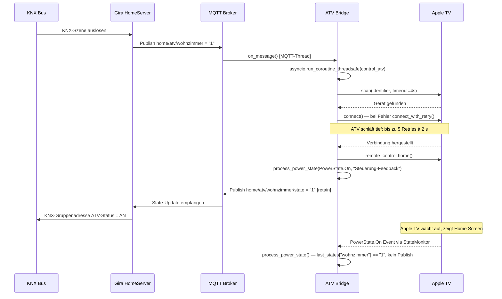
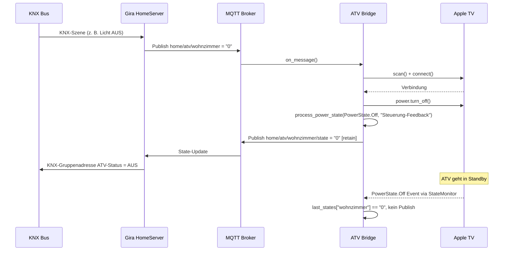
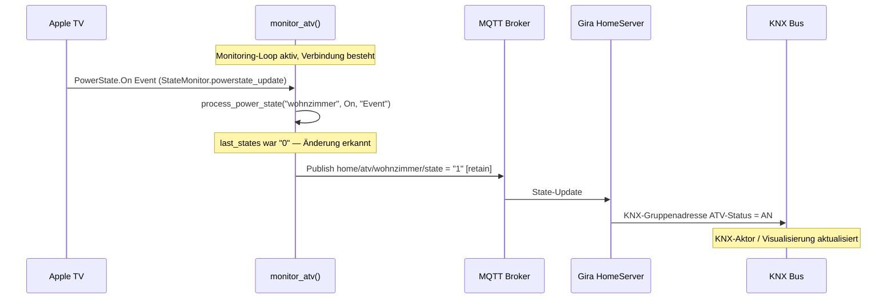
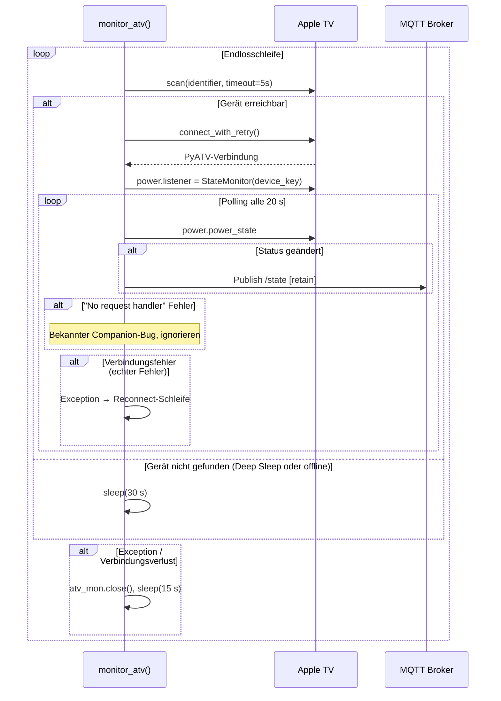
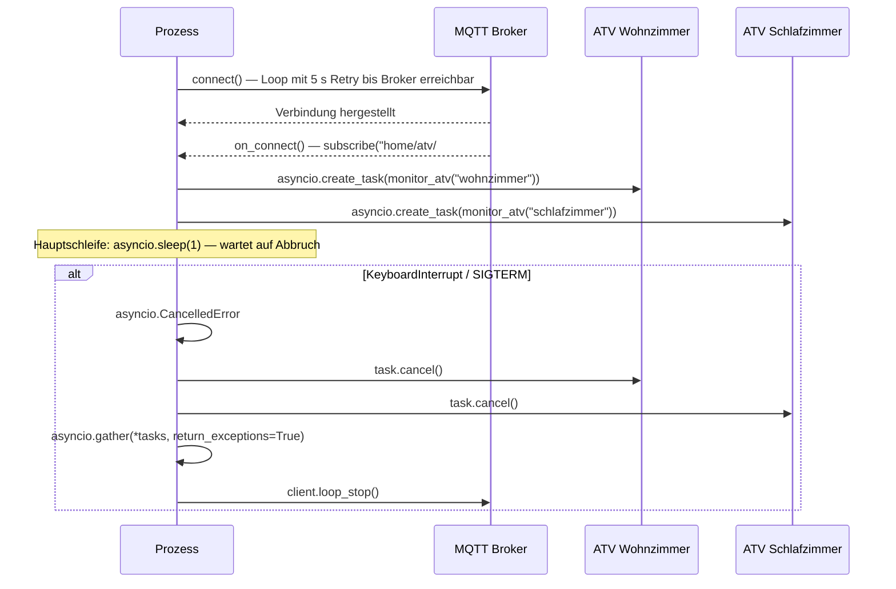

# §06 Laufzeitsicht — ATV-KNX Bridge

## Szenario 1: Apple TV einschalten (KNX → ATV)

Auslöser: KNX-Szene (z. B. "Heimkino AN") setzt Gruppenadresse → Gira HomeServer
publiziert MQTT-Befehl.

**Schlüsselpunkt — Optimistisches Feedback:** Die Bridge publiziert den neuen State
(`"1"`) sofort nach dem Senden des Befehls, ohne auf die Bestätigung des Apple TVs zu
warten. Das ist notwendig, weil das ATV nach dem Deep Sleep mehrere Sekunden braucht,
bevor es PyATV-Events liefert. Der KNX-Bus bekommt so sofort Rückmeldung.

---

## Szenario 2: Apple TV ausschalten (KNX → ATV)

---

## Szenario 3: Statusrückmeldung — ATV selbst eingeschaltet

Jemand schaltet das Apple TV per physischer Fernbedienung oder Apple Remote ein,
ohne eine KNX-Szene zu aktivieren. Die Bridge erkennt dies proaktiv.

Falls der Event ausbleibt (Companion-Bug), greift der Polling-Mechanismus
spätestens nach **20 Sekunden**.

---

## Szenario 4: Monitoring-Loop (Dauerbetrieb)

Läuft permanent als asyncio-Task parallel für `wohnzimmer` und `schlafzimmer`.

---

## Szenario 5: Startup und Shutdown

---

## Nebenläufigkeitsmodell

Die Bridge verwendet **Python asyncio** mit einem einzigen Event-Loop-Thread.

| Komponente | Thread / Kontext | Kommunikationsweg |
|------------|-----------------|------------------|
| `monitor_atv()` (×2) | asyncio-Task | `await` |
| `control_atv()` | asyncio-Coroutine | `await` |
| `on_message()` (paho-mqtt) | MQTT-eigener Thread | `run_coroutine_threadsafe()` |
| `on_connect()` | MQTT-eigener Thread | direkt (kein shared state) |

`asyncio.run_coroutine_threadsafe()` ist der einzige Thread-Übergang. Das `loop`-Objekt
wird beim Start in `mqtt.Client.userdata` gespeichert und ist von `on_message` aus
zugreifbar.
