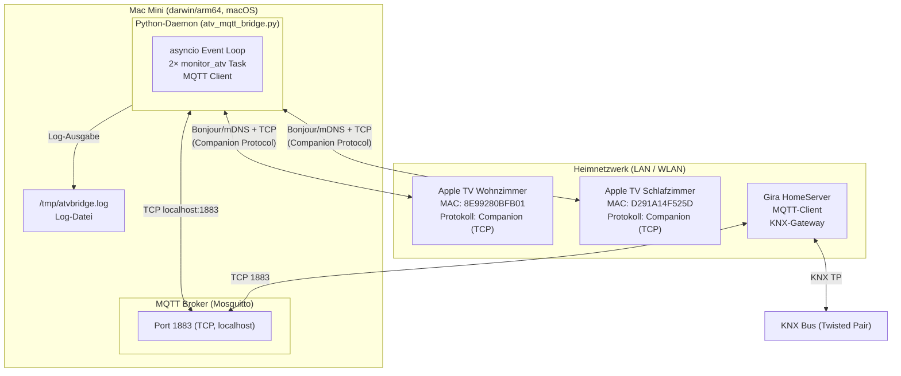

# §07 Verteilungssicht — ATV-KNX Bridge

## Infrastrukturübersicht



---

## Komponenten und Laufzeitumgebung

### Mac Mini (Host)

| Eigenschaft | Wert |
|-------------|------|
| Plattform | darwin/arm64 (Apple Silicon) |
| Betriebssystem | macOS (Version nicht spezifiziert) |
| Python | Muss PyATV, paho-mqtt unterstützen (Python 3.10+) |
| Netzwerk | Heimnetzwerk (muss Apple TVs via Bonjour erreichen) |

### MQTT Broker (Mosquitto)

| Eigenschaft | Wert |
|-------------|------|
| Adresse | `localhost:1883` |
| Auth | Benutzername/Passwort (`mqtt_user` / hardcodiert — siehe §11) |
| Retained Messages | Aktiv (letzte `/state`-Werte werden gespeichert) |
| Wildcard-Sub | `home/atv/#` (Bridge), `home/atv/+/state` (Gira) |

Der Broker läuft **auf demselben Mac Mini** wie die Bridge. Eine externe MQTT-Instanz
ist nicht konfiguriert; der Hostname `localhost` ist fest kodiert.

### Prozessstart (derzeit nicht formalisiert)

Die Bridge wird aktuell manuell gestartet. Für einen produktiven Betrieb als Daemon
empfiehlt sich **launchd** (macOS-nativer Service-Manager):

```xml
<!-- /Library/LaunchDaemons/de.fabian.atv-bridge.plist -->
<?xml version="1.0" encoding="UTF-8"?>
<!DOCTYPE plist PUBLIC "-//Apple//DTD PLIST 1.0//EN"
  "http://www.apple.com/DTDs/PropertyList-1.0.dtd">
<plist version="1.0">
<dict>
    <key>Label</key>
    <string>de.fabian.atv-bridge</string>
    <key>ProgramArguments</key>
    <array>
        <string>/usr/bin/python3</string>
        <string>/path/to/atv_mqtt_bridge.py</string>
    </array>
    <key>RunAtLoad</key>
    <true/>
    <key>KeepAlive</key>
    <true/>
    <key>StandardOutPath</key>
    <string>/var/log/atv-bridge/out.log</string>
    <key>StandardErrorPath</key>
    <string>/var/log/atv-bridge/err.log</string>
</dict>
</plist>
```

> **Offenes Risiko:** Ohne launchd-Integration startet die Bridge nach einem
> System-Neustart nicht automatisch (→ §11).

### Logdatei

| Eigenschaft | Wert |
|-------------|------|
| Pfad | `/tmp/atvbridge.log` |
| Format | `%(asctime)s [ATV-Bridge] %(levelname)s: %(message)s` |
| Log-Level | `INFO` (Datei + stdout) |
| Rotation | **Keine** — Datei wächst unbegrenzt (→ §11) |

---

## Netzwerkvoraussetzungen

| Verbindung | Anforderung |
|-----------|-------------|
| Mac Mini → MQTT Broker | localhost (keine Netzwerkkonfiguration nötig) |
| Mac Mini → Apple TV | Bonjour/mDNS aktiv im LAN; TCP-Port für Companion nicht blockiert |
| Gira HomeServer → MQTT Broker | TCP 1883 im LAN erreichbar |
| Apple TV | Im selben WLAN/LAN wie Mac Mini (mDNS-Reichweite) |

---

## Deployment-Gaps (Stand Analyse)

| Gap | Beschreibung |
|-----|-------------|
| Kein Service-Management | Bridge wird manuell gestartet; kein Autostart nach Reboot |
| Kein Log-Rotation | `/tmp/atvbridge.log` wächst unbegrenzt |
| Kein Monitoring | Kein Healthcheck oder Alert bei Prozessabsturz |
| Python-Umgebung undokumentiert | Kein `requirements.txt` oder `pyproject.toml` im Repository |
| Container-Konflikt | `.container-use.yaml` definiert golang:1.21 — nicht für Python-Bridge nutzbar |
